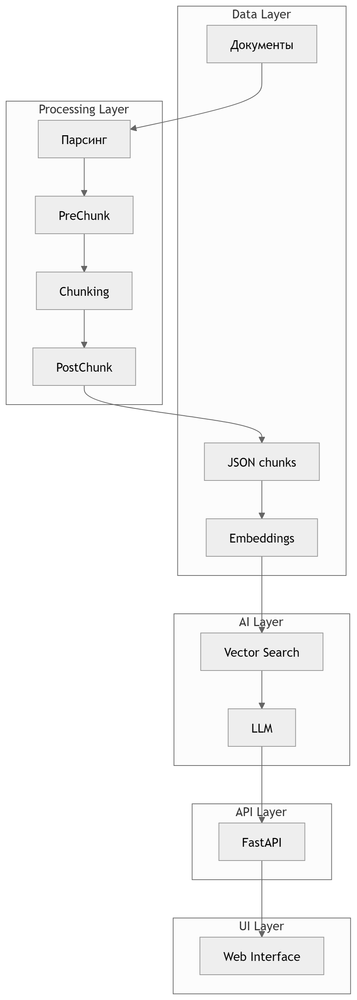

---


# 🧠 RAG-ассистент тренера

Система интеллектуального поиска знаний из спортивной литературы  
с точным цитированием источников.

---

## 🚀 О проекте

RAG-ассистент — это AI-сервис, который позволяет:

- находить информацию в книгах,
- формировать структурированные ответы,
- ссылаться на конкретные страницы источников.

📌 Основная идея:
> превратить библиотеку книг в интерактивную экспертную систему

---

## ❗ Проблема

Тренеры и спортсмены:

- работают с большим количеством литературы
- тратят много времени на поиск
- не могут быстро получить **точный ответ с подтверждением**

---

## ✅ Решение

Использована архитектура **RAG (Retrieval-Augmented Generation)**:

1. поиск релевантных фрагментов
2. формирование ответа LLM
3. обязательное цитирование

---

# 🧩 Архитектура системы

## 📌 Общая схема pipeline

```
A[Документы] --> B[Парсинг]
B --> C[PreChunk]
C --> D[Chunking]
D --> E[PostChunk]
E --> F[Embeddings]
F --> G[Vector DB]
G --> H[Retrieval]
H --> I[LLM]
I --> J[Ответ]
````

---

## 📌 Архитектура уровней



---

# 🔥 Уникальность проекта

## 🧠 1. Модульный pipeline обработки

Каждый этап — независимый модуль:

* можно менять отдельно
* можно тестировать отдельно
* можно улучшать без ломки системы

---

## 📄 2. Поддержка разных типов документов

* DOCX
* TXT
* PDF (векторные)
* PDF (сканы → OCR)
* изображения

➡️ каждый тип имеет свой parser

---

## 🧩 3. PreChunk (ключевое ноу-хау)

Перед чанкингом выполняется:

* восстановление структуры документа
* исправление потери `parent_id`
* обработка PageBreak
* назначение ролей:

  * chapter
  * section
  * text
  * list_item

👉 Это превращает текст в **структурированные знания**

---

## ✂️ 4. Контролируемый chunking

```python
MAX_CHARACTERS = 1500
NEW_AFTER_N_CHARS = 1200
OVERLAP = 200
OVERLAP_ALL = True
```

📌 Результат:

* сохранение смысла
* минимизация потерь контекста

---

## 🧬 5. RAG-ready структура

```json
{
  "id": "...",
  "text": "...",
  "metadata": {
    "doc_id": "book_001",
    "section_title": "...",
    "page_start": 1,
    "page_end": 2,
    "citation": {...}
  }
}
```

---

## 🧠 6. Управляемый Retrieval

```python
selected_doc_ids = ["book_001"]
```

Позволяет:

* включать/выключать книги
* тестировать разные сценарии
* управлять качеством ответа

---

## 🤖 7. Контролируемая генерация

LLM:

* работает только с контекстом
* не выдумывает
* всегда указывает источник

---

# 🔄 Поток данных

.png>)

---

# 🖥 Интерфейс

Функции:

* ввод вопроса
* выбор книг
* настройка top_k
* получение ответа

---

# ⚙️ Технологии

## Backend

* Python
* FastAPI
* Uvicorn

## AI

* OpenAI API
* text-embedding-3-small

## Data

* ChromaDB

## Обработка

* Unstructured
* PaddleOCR

## Deploy

* Ubuntu VPS
* Nginx

---

# 📊 Пример работы

**Запрос:**

> Как обучать действиям на ближней дистанции?

**Ответ:**

* структурированный
* с цитированием страниц
* без галлюцинаций

---

# 🧪 Тестирование

Проверено:

* chunking
* retrieval
* embeddings
* API
* LLM ответы

---

# ⚠️ Ограничения

* section_title не всегда точный
* нет reranking
* нет multi-document reasoning

---

# 🚀 Планы развития

## Ближайшие

* улучшение структуры документа
* reranker
* улучшение chunking

## Среднесрочные

* расширение библиотеки
* улучшение UI

## Долгосрочные

👉 мультиагентная система
**"Тренерский штаб"**

---

# 🔐 Безопасность

* доступ по коду
* ограничение запросов

---

# 🌐 Демо

[http://193.0.179.106/](http://193.0.179.106/)

---


